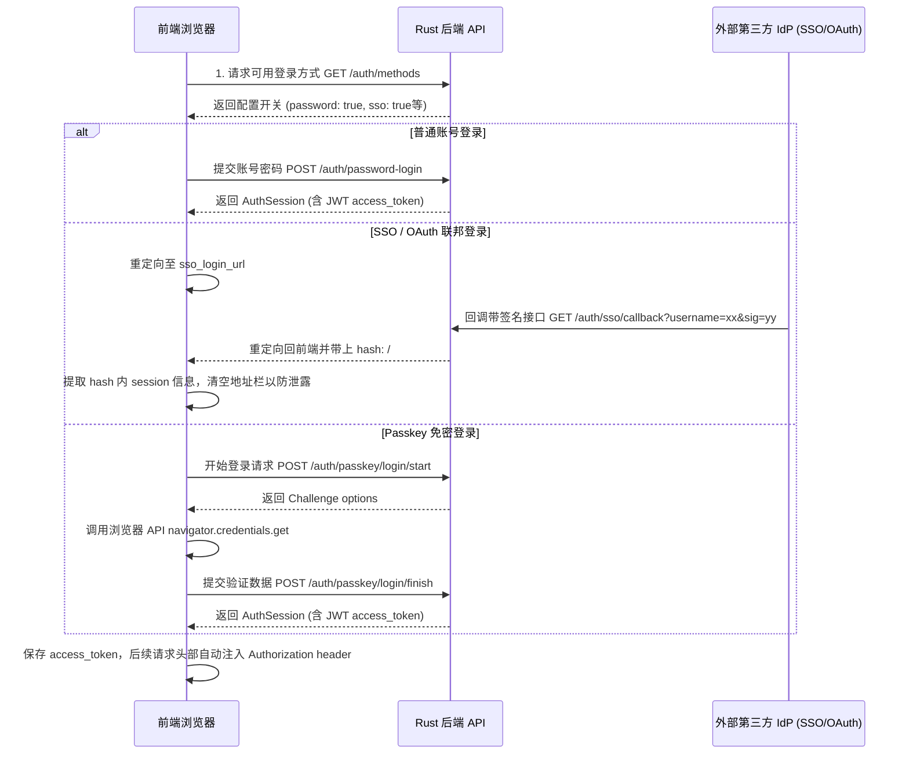
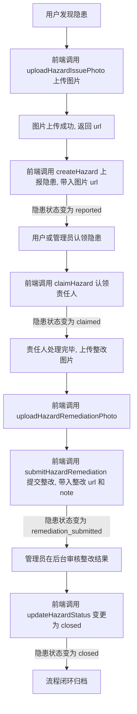

# 前后端协作开发与对接指南

本文档旨在梳理实验室安全系统（Lab Safety System）的前后端对接约定、开发联调配置、API 映射关系以及核心业务流程，以便前后端开发人员高效协作。

---

## 1. 架构与技术栈

本系统采用前后端分离的架构：
- **后端 (主工程)**: 采用 **Rust + Axum + PostgreSQL**，提供 RESTful 风格的 API 接口，并包含命令行管理工具。
- **前端 (子模块)**: 位于 [`frontend/`](../frontend)，采用 **React + TypeScript + Vite + TailwindCSS v4** 构建。

---

## 2. 本地开发与联调配置

### 2.1 启动后端服务
在主工程根目录下，根据 `.env.example` 创建本地 `.env` 配置文件：
```bash
cp .env.example .env
```
配置好数据库和密钥后，可以通过以下几种方式运行后端：
- **使用 Docker Compose 启动依赖（推荐）**:
  ```bash
  docker compose up -d --build
  ```
- **本地直接运行 Rust 服务**:
  ```bash
  cargo run --bin lab-safety-system
  ```
  *注意：本地运行需要已启动 PostgreSQL 并正确配置环境变量 `DATABASE_URL`。*

### 2.2 启动前端服务
进入 `frontend` 目录安装依赖并运行开发服务器：
```bash
cd frontend
npm install
npm run dev
```

### 2.3 接口代理配置 (Vite Proxy)
前端通过 [`frontend/vite.config.ts`](../frontend/vite.config.ts) 自动将以 `/api` 开头的请求代理到后端，以解决跨域问题。
- **默认代理目标**: `http://127.0.0.1:8080`
- **自定义代理目标**: 可在启动前端前设置环境变量 `VITE_API_PROXY_TARGET`，例如：
  ```bash
  VITE_API_PROXY_TARGET=http://localhost:8080 npm run dev
  ```

---

## 3. 接口规范与约定

- **接口前缀**: 所有 API 请求路径均以 `/api/v1` 开头。
- **数据格式**: 请求体和响应体均采用 `application/json` 格式（文件上传除外）。
- **鉴权机制**: 需要登录的受保护接口需在请求头携带 Bearer Token：
  ```http
  Authorization: Bearer <access_token>
  ```
- **错误处理**: 后端发生业务错误时，将返回对应的 HTTP 错误码（如 `400`, `401`, `403`, `404` 等），且返回体格式统一为：
  ```json
  { "detail": "具体的错误信息或原因" }
  ```
  前端 `api.ts` 的 `request()` 目前将错误响应体作为纯文本抛出（`throw new Error(message)`），尚未解析 `detail` 字段；联调时若看到 JSON 字符串报错，属预期行为，后续可改为结构化解析。
- **时间与日期格式**:
  - `DateTime` 类型字段（如创建时间、更新时间）：使用 UTC ISO 8601 标准字符串，如 `"2026-07-06T10:00:00Z"`。
  - 日期字段（仅限日期）：使用 `YYYY-MM-DD` 格式。

---

## 4. API 接口与前端方法映射一览表

前端将所有的 API 调用封装在 [`frontend/src/api.ts`](../frontend/src/api.ts) 中的 `api` 对象中。下表展示了后端接口与前端方法的对应关系：

| 模块 | 后端 API 接口 (HTTP Method & Path) | 前端方法名 (`api.xxx`) | 请求参数 / Payload 类型 | 响应数据类型 | 鉴权 / 权限要求 |
| :--- | :--- | :--- | :--- | :--- | :--- |
| **基础与健康** | `GET /api/v1/ready` | *前端暂未封装* | - | `{ status: "ok" }` | 否 |
| | `GET /api/v1/health` | *前端暂未封装* | - | `{ status: "ok" }` | 否 |
| **认证与登录** | `GET /api/v1/auth/methods` | `authMethods()` | - | `AuthMethods` | 否 |
| | `POST /api/v1/auth/password-login` | `passwordLogin(username, password)` | JSON: `username`, `password` | `AuthSession` | 否 |
| | `GET /api/v1/auth/me` | `me()` | - | `AuthUser` | 是 |
| | `GET /api/v1/auth/sso/callback` | *通过浏览器重定向 hash 自动获取* | Query: `username`, `sig`, `redirect` 等 | - (解析 hash 写入 `AuthSession`) | 否 |
| | `GET /api/v1/auth/oauth/callback` | *同上* | Query: `username`, `sig`, `redirect` 等 | - | 否 |
| | `POST /api/v1/auth/passkey/login/start` | `passkeyLoginStart(username)` | JSON: `username` | `PasskeyChallenge<PublicKeyCredentialRequestOptions>` | 否 |
| | `POST /api/v1/auth/passkey/login/finish` | `passkeyLoginFinish(challengeId, credential)` | JSON: `challenge_id`, `credential` | `AuthSession` | 否 |
| | `POST /api/v1/auth/passkey/register/start` | `passkeyRegisterStart()` | - | `PasskeyChallenge<PublicKeyCredentialCreationOptions>` | 是 |
| | `POST /api/v1/auth/passkey/register/finish`| `passkeyRegisterFinish(challengeId, credential, name)`| JSON: `challenge_id`, `credential`, `name`| `PasskeySummary` | 是 |
| | `GET /api/v1/auth/passkeys` | `passkeys()` | - | `PasskeySummary[]` | 是 |
| **用户管理** | `GET /api/v1/users` | `users()` | 可选分页/搜索 query | `User[]` | 是 / 管理员 |
| | `POST /api/v1/users` | `createUser(payload)` | `UserCreate` | `User` | 是 / 管理员 |
| **法规条例** | `GET /api/v1/regulations` | `regulations(q)` | `q` (搜索关键字) | `Regulation[]` | 是 |
| | `POST /api/v1/regulations` | `createRegulation(payload)` | `RegulationCreate` | `Regulation` | 是 / 管理员 |
| | `POST /api/v1/regulations/upload` | `uploadRegulation(file)` | FormData (`file` 字段) | `{ url, filename, size }` | 是 / 管理员 |
| **事故案例** | `GET /api/v1/incidents` | `incidents()` | - | `Incident[]` | 是 |
| | `POST /api/v1/incidents` | `createIncident(payload)` | `IncidentCreate` | `Incident` | 是 / 管理员 |
| | `POST /api/v1/incidents/upload` | `uploadIncident(file)` | FormData (`file` 字段) | `{ url, filename, size }` | 是 / 管理员 |
| **安全培训** | `GET /api/v1/trainings` | `trainings()` | - | `Training[]` | 是 |
| | `POST /api/v1/trainings` | `createTraining(payload)` | `TrainingCreate` | `Training` | 是 / 管理员 |
| | `GET /api/v1/exam-results` | *前端暂未封装 `listExamResults()`* | - | `ExamResult[]` | 是 (用户仅本人，管理员全部) |
| | `POST /api/v1/exam-results` | `createExamResult(trainingId, userId, score)` | JSON: `training_id`, `user_id`, `score` | `ExamResult` | 是 |
| **设备与预约** | `GET /api/v1/equipment` | `equipment(q)` | `q` (搜索关键字) | `Equipment[]` | 是 |
| | `POST /api/v1/equipment` | `createEquipment(payload)` | `EquipmentCreate` | `Equipment` | 是 / 管理员 |
| | `GET /api/v1/equipment-bookings` | `bookings()` | - | `Booking[]` | 是 (用户仅本人，管理员全部) |
| | `POST /api/v1/equipment-bookings` | `createBooking(payload)` | `BookingCreate` | `Booking` | 是 |
| **报修工单** | `GET /api/v1/repair-tickets` | `repairs()` | - | `RepairTicket[]` | 是 (用户仅本人，管理员全部) |
| | `POST /api/v1/repair-tickets` | `createRepair(payload)` | `RepairCreate` | `RepairTicket` | 是 |
| | `PATCH /api/v1/repair-tickets/{id}` | `updateRepairStatus(repairId, status)` | JSON: `status` | `RepairTicket` | 是 / 管理员 |
| **安全隐患** | `GET /api/v1/hazards` | `hazards(q)` | `q` (搜索关键字) | `SafetyHazard[]` | 是 (用户仅本人，管理员全部) |
| | `POST /api/v1/hazards` | `createHazard(payload)` | `HazardCreate` | `SafetyHazard` | 是 |
| | `POST /api/v1/hazards/{id}/claim` | `claimHazard(hazardId, userId)` | JSON: `responsible_user_id` | `SafetyHazard` | 是 (用户仅领本人，管理员任意) |
| | `POST /api/v1/hazards/{id}/remediation` | `submitHazardRemediation(id, url, note)` | JSON: `remediation_photo_url`, `remediation_note`| `SafetyHazard`| 是 (仅限责任人) |
| | `PATCH /api/v1/hazards/{id}/status` | `updateHazardStatus(hazardId, status)` | JSON: `status` | `SafetyHazard` | 是 / 管理员 |
| | `POST /api/v1/hazards/upload/issue-photo`| `uploadHazardIssuePhoto(file)`| FormData (`file` 字段) | `{ url, filename, size }` | 是 |
| | `POST /api/v1/hazards/upload/remediation-photo`| `uploadHazardRemediationPhoto(file)`| FormData (`file` 字段) | `{ url, filename, size }` | 是 |
| **统计分析** | `GET /api/v1/analytics/dashboard` | `dashboard()` | - | `DashboardStats` | 是 |
| | `GET /api/v1/analytics/regulations` | `regulationAnalytics()` | - | `RegulationAnalytics` | 是 |
| | `GET /api/v1/analytics/incidents` | `incidentAnalytics()` | - | `IncidentAnalytics` | 是 |
| | `GET /api/v1/analytics/hazards` | `hazardAnalytics()` | - | `HazardAnalytics` | 是 (用户仅本人相关统计) |

---

## 5. 核心业务协作流程说明

### 5.1 登录与会话初始化流程
前端加载时需要识别系统的多种认证形式。流程如下：



### 5.2 安全隐患生命周期闭环流程
隐患状态机流转为：`reported (已上报)` -> `claimed (已认领)` -> `remediation_submitted (已整改/待审核)` -> `closed (已归档闭环)`。具体前后端流转对接过程如下：



- **图片上传对接细节**: 隐患图片不会与表单一同提交。前端需要**先**调用上传接口获得文件的服务器绝对/相对 URL（例如 `/uploads/hazards/issue/xxxx.jpg`），随后在创建/提交时，把该 URL 字符串传入对应的 `issue_photo_url` 或 `remediation_photo_url` 中。

---

## 6. 联调验证与测试

当本地前后端联调完毕后，可以通过项目提供的自动化冒烟测试来验证前后端交互的健壮性。
在 [`frontend/`](../frontend) 目录执行（需先启动后端，并用 `npm run dev` 启动前端，默认端口 **5173**）：
```bash
npm run build
E2E_BASE_URL=http://localhost:5173 \
E2E_ADMIN_USER=cli_super \
E2E_ADMIN_PASSWORD='StrongerAdmin123!' \
  npm run e2e:smoke
```
`E2E_ADMIN_USER` / `E2E_ADMIN_PASSWORD` 须与本地已创建的系统管理员账号一致；`tests/e2e-smoke.mjs` 中的默认值分别为 `cli_super` 与 `StrongerAdmin123!`。

此命令将运行 Playwright 冒烟测试，自动模拟管理员与普通用户的完整交互流程（登录、Passkey、法规/案例/培训/设备/用户创建、隐患上报、认领、整改照片上传等），用于快速验证前后端连通性。
